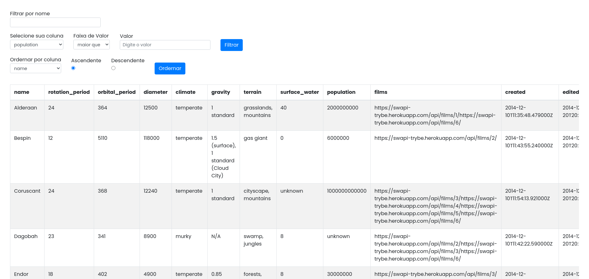
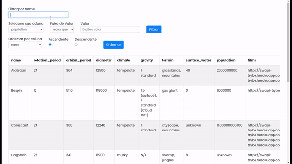

[![Contributors][contributors-shield]][contributors-url]
[![Forks][forks-shield]][forks-url]
[![Stargazers][stars-shield]][stars-url]
[![Issues][issues-shield]][issues-url]
[![LinkedIn][linkedin-shield]][linkedin-url]

<!-- PROJECT LOGO -->
<br />
<p align="center">
  <a href="https://github.com/Scriblet/StarWars-Datable-Hooks">
    
  </a>

  <h3 align="center">Star Wars Datable Hooks</h3>

  <p align="center">
    Filter list of planets from the StarWars universe using Context API and Hooks to control global states.
    <br />
    <a href="https://github.com/Scriblet/StarWars-Datable-Hooks"><strong>Explore the docs »</strong></a>
    <br />
    <br />
    <a href="https://github.com/Scriblet/StarWars-Datable-Hooks">View Demo</a>
    ·
    <a href="https://github.com/Scriblet/StarWars-Datable-Hooks/issues">Report Bug</a>
    ·
    <a href="https://github.com/Scriblet/StarWars-Datable-Hooks/issues">Request Feature</a>
  </p>
</p>

<!-- TABLE OF CONTENTS -->
<details open="open">
  <summary>Table of Contents</summary>
  <ol>
    <li>
      <a href="#about-the-project">About The Project</a>
      <ul>
        <li><a href="#built-with">Built With</a></li>
      </ul>
    </li>
    <li>
      <a href="#getting-started">Getting Started</a>
      <ul>
        <li><a href="#prerequisites">Prerequisites</a></li>
        <li><a href="#installation">Installation</a></li>
      </ul>
    </li>
    <li><a href="#usage">Usage</a></li>
    <li><a href="#roadmap">Roadmap</a></li>
    <li><a href="#contributing">Contributing</a></li>
    <li><a href="#license">License</a></li>
    <li><a href="#contact">Contact</a></li>
    <li><a href="#acknowledgements">Acknowledgements</a></li>
  </ol>
</details>


<!-- ABOUT THE PROJECT -->
## About The Project

<p align="center">
  
  <br />
</p>

This project contains a table filled with data about Star Wars planets from an API request, a global state made with Context API and a form with functions that modify the global state and change the table according to the changes.

## Built With

* [Bootstrap](https://getbootstrap.com)
* [React](https://reactjs.org)
* [ContextAPI](https://pt-br.reactjs.org/docs/context.html)
* [ESLint](https://eslint.org)
* [React Testing Library](https://testing-library.com/docs/react-testing-library/intro/)

<!-- GETTING STARTED -->
# Getting Started

This is an example of how you may give instructions on setting up your project locally.
To get a local copy up and running follow these simple example steps.

## Prerequisites

* yarn
  ```sh
  npm install --global yarn
  ```

## Installation

1. Clone the repo
   ```sh
   git clone https://github.com/tryber/sd-07-project-starwars-datatable-hooks.git
   ```
2. Install YARN packages
   ```sh
   yarn install
   ```

<!-- USAGE -->
## Usage


<!-- ROADMAP -->
## Roadmap

See the [open issues](https://github.com/Scriblet/StarWars-Datable-Hooks/issues) for a list of proposed features (and known issues).


<!-- CONTRIBUTING -->
## Contributing

Contributions are what make the open source community such an amazing place to be learn, inspire, and create. Any contributions you make are **greatly appreciated**.

1. Fork the Project
2. Create your Feature Branch (`git checkout -b feature/AmazingFeature`)
3. Commit your Changes (`git commit -m 'Add some AmazingFeature'`)
4. Push to the Branch (`git push origin feature/AmazingFeature`)
5. Open a Pull Request


<!-- LICENSE -->
<!-- ## License

Distributed under the MIT License. See `LICENSE` for more information. -->

<!-- CONTACT -->
## Contact

Project Link: [https://github.com/Scriblet/StarWars-Datable-Hooks](https://github.com/Scriblet/StarWars-Datable-Hooks)  
Portfolio> [https://scriblet.github.io/Portfolio/](https://scriblet.github.io/Portfolio/)

<!-- ACKNOWLEDGEMENTS -->
## Acknowledgements
* [Bootstrap](https://getbootstrap.com)
* [React](https://reactjs.org)
* [ContextAPI](https://pt-br.reactjs.org/docs/context.html)

<!-- MARKDOWN LINKS & IMAGES -->
<!-- https://www.markdownguide.org/basic-syntax/#reference-style-links -->
[contributors-shield]: https://img.shields.io/github/contributors/Scriblet/StarWars-Datable-Hooks.svg?style=for-the-badge
[contributors-url]: https://github.com/Scriblet/StarWars-Datable-Hooks/graphs/contributors
[forks-shield]: https://img.shields.io/github/forks/Scriblet/StarWars-Datable-Hooks.svg?style=for-the-badge
[forks-url]: https://github.com/Scriblet/StarWars-Datable-Hooks/network/members
[stars-shield]: https://img.shields.io/github/stars/Scriblet/StarWars-Datable-Hooks.svg?style=for-the-badge
[stars-url]: https://github.com/Scriblet/StarWars-Datable-Hooks/stargazers
[issues-shield]: https://img.shields.io/github/issues/Scriblet/StarWars-Datable-Hooks.svg?style=for-the-badge
[issues-url]: https://github.com/Scriblet/StarWars-Datable-Hooks/issues
[linkedin-shield]: https://img.shields.io/badge/-LinkedIn-black.svg?style=for-the-badge&logo=linkedin&colorB=555
[linkedin-url]: https://linkedin.com/in/lucas-nonato1/
[product-screenshot]: images/screenshot.png
